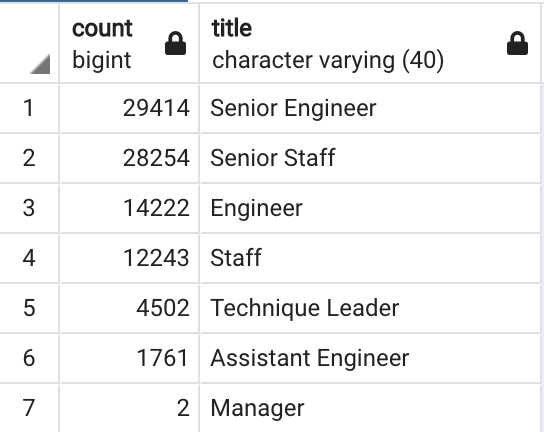
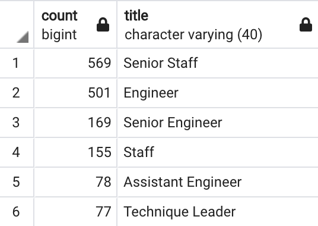

# Pewlett_Hackard

## Project Overview
The purpose of this project is to analyze the employment database of the fictional company 'Pewlett-Hackard' to find the number of retiring employees by position. To prepare for the incoming waves of retirement, it is suggested to create a mentorship program to train the next generation of employees. The feasibility of this program is also investigated.

## Results
The table below shows the number of retirement age employees born between January 1, 1952 and December 31, 1955 grouped by title in the company.

-The positions most affected by the incoming wave of retirement will be "Senior Engineer" and "Senior Staff."
-A total of 90,398 employees are retiring or nearing retirement.
-Two managers are retiring, which is significant because there are only nine current managers.
-1,549 current employees born between January 1, 1965 and December 31, 1965 are eligible to participate in the mentorship program.

## Summary
As the number of retirements begin to make an impact, Pewlett-Hackard will need to train new employees to fill these vacant positions. Eventually, there will need to be 90,398 roles filled across all departments. Even two high-level managment positions must be filled.

One potential solution is to create a company mentoring program, which would have qualified, retirement-ready employees train the next generation of Pewlett-Hackard workers. The table below is a breakdown of the positions of the eligible mentors.

-- The query to create this mentorship table is:
SELECT COUNT(emp_no), title
FROM mentorship_eligibility
GROUP BY title
ORDER BY count DESC;

After analyzing the copmany employment records, it is found that 1,549 current employees would qualify for becoming mentors. Interestingly, while only 11% of mentors have the title "Senior Engineer," approximately 32.5% of retirees are Senior Engineers. Furthermore, none of the mentors have the title "Manager", which is a critical position that needs to be filled after the current managers retire. Although having mentors would be helpful, there are not enough new employees to be trained. Therefore, if Pewlett-Hackard decides to create a mentorship program to counteract the large wave of retirement headed towards the company, it is recommended to widely expand hiring efforts. Also, it is recommended to expand the pool of qualifed mentors by widening the birth_year parameter. By increasing the number of both mentors and new employees, it will be possible to prepare for the incoming wave of retirement facing Pewlett-Hackard.
